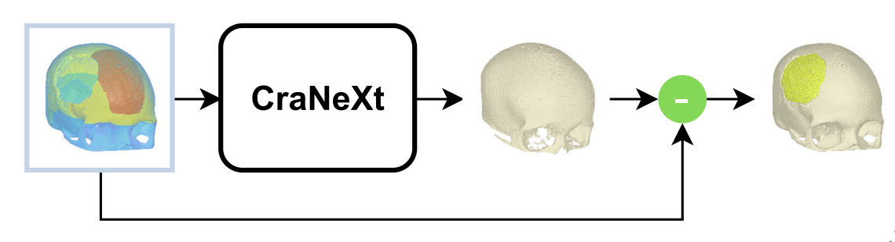
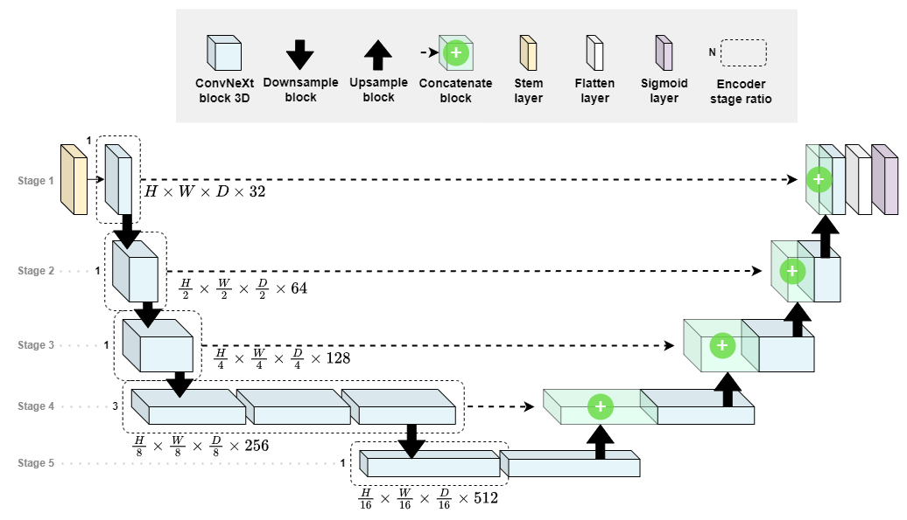

# CraNeXt

**CraNeXt** is a deep learning model for skull reconstruction tasks. The input is a binary voxel is a defective skull, and the output is a binary voxel representing a complete skull.

<center>
<picture>
  
</picture>
</center>


# Usage Example

<a href="https://colab.research.google.com/github/guitared/CraNeXt/blob/main/example.ipynb" target="_blank"></a>

For a detailed demonstration of how to use CraNeXt, please refer to our `example.ipynb` notebook. This notebook provides step-by-step instructions and code examples for:

- Downloading sample SkullBreak dataset and preparing input data
- Using the CraNeXt model with pretrained weights on SkullBreak
- Running skull reconstruction and performing evaluation
- Visualizing reconstruction result

You can run the notebook directly in Google Colab by clicking the Colab badge above or locally.

<center>
<picture>
  <source media="(prefers-color-scheme: dark)" srcset="assets/architecture-dark.png">
  
</picture>
</center>


# Requirements
Use `pip` to install the requirements as follows:
```
!pip install -r requirements.txt
```


# Citation

Please refer to our full manuscript in [IEEE Access](https://ieeexplore.ieee.org/document/10559595). If you use the model, you can cite it with the following bibtex.

```
@article {CraNeXt,
  author    = { Kesornsri, Thathapatt and Asawalertsak, Napasara and Tantisereepatana, Natdanai and Manowongpichate, Pornnapas and Lohwongwatana, Boonrat and Puncreobutr, Chedtha and Achakulvisut, Titipat and Vateekul, Peerapon },
  journal   = { IEEE Access }, 
  title     = { CraNeXt: Automatic Reconstruction of Skull Implants With Skull Categorization Technique }, 
  year      = { 2024 },
  volume    = { 12} ,
  pages     = { 84907--84922 },
  keywords  = { Skull;Implants;Image reconstruction;Shape measurement;Three-dimensional displays;Computer architecture;Computational modeling;Skull reconstruction;deep learning;skull categorization;autoimplant;volumetric shape completion },
  doi       = { 10.1109/ACCESS.2024.3415173 },
  url       = { https://doi.org/10.1109/access.2024.3415173 }
}
```
